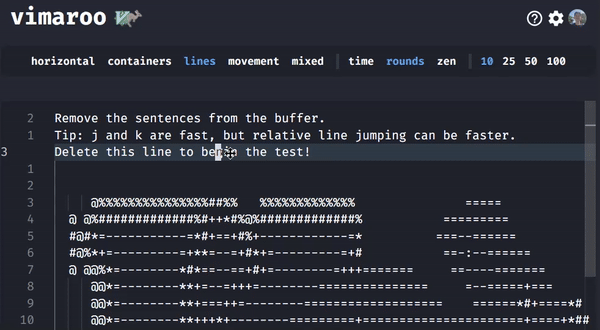

# vimaroo 



This website was created with the intent of making it easy to practice Vim keybinds with a set of motion-focused test. This website was inspired by ThePrimeagen's [vim-be-good](https://github.com/ThePrimeagen/vim-be-good) Neovim plugin and [Monkeytype](https://monkeytype.com/).

## Tech Stack

- SvelteKit
- TypeScript
- TailwindCSS
- Supabase (and PostgreSQL)

## Setup / Development

Clone the repository and install all the dependencies:

```bash
git clone https://github.com/tomasohCHOM/QuizZard.git
cd QuizZard
npm install
```

Then start the development process:

```bash
npm run dev
```

To build and start in production mode:

```bash
npm run build
npm run preview
```

---

Developed with 🔥 by Chom.
